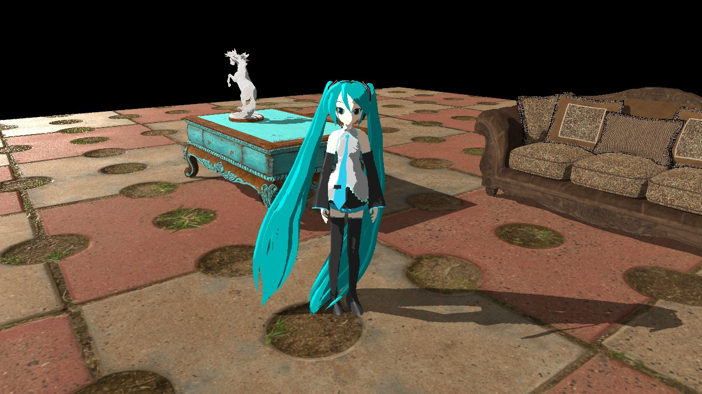
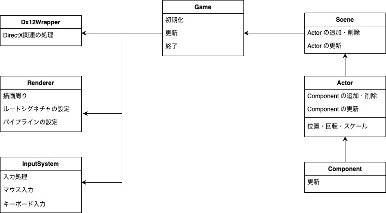
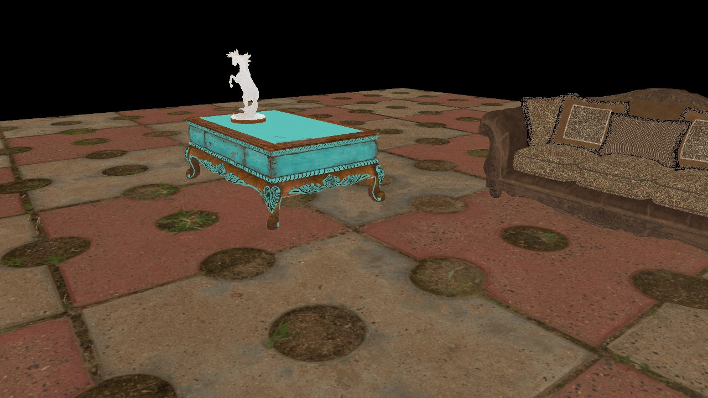
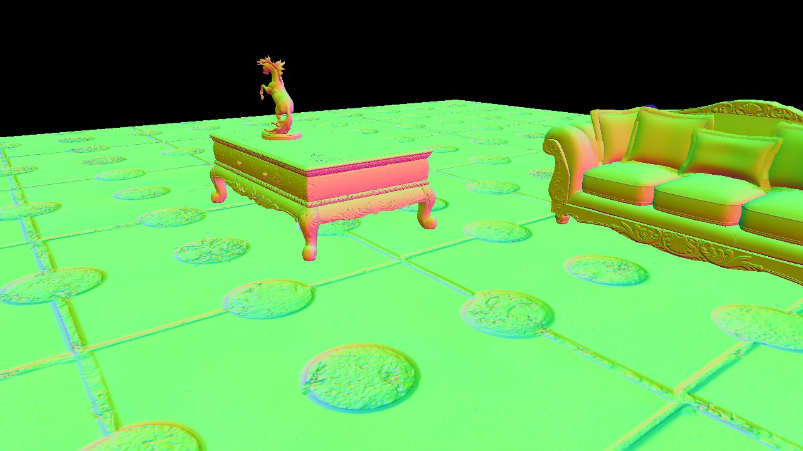
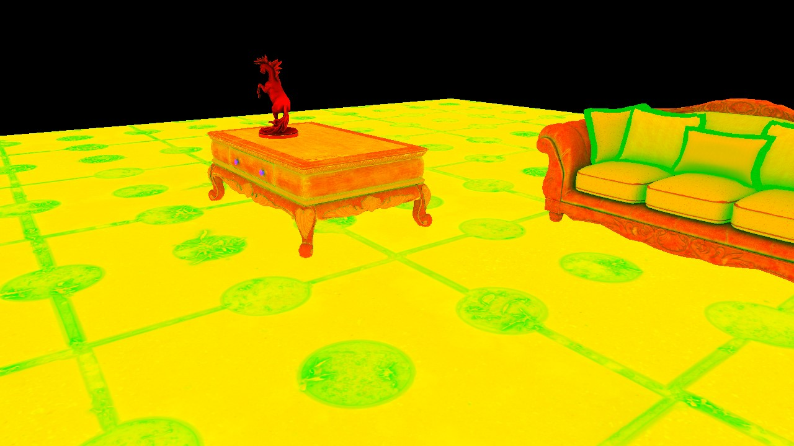

# 作品説明



## 概要

- C++を用いた簡易ゲームエンジンの開発
- DirectX12 を用いたレンダリングエンジンの開発

### 使用ライブラリ

- Windows SDK
- d3dx12.h
- DirectXTex
- ImGui
- FBX SDK

### 開発環境・ツール

- Windows 10
- NVIDIA GeForce RTX 3080
- Visual Studio 2022
- PIX for Windows

## 目的

- 既存のゲームエンジンを用いないゲーム開発環境の構築
- 低レベルグラフィックス API を用いレンダリングエンジンの実装
- シェーダー開発による基礎的なグラフィックス表現の実現

### 本作品を製作するにあたって

- メインはレンダリングエンジンとシェーダー開発
- ゲームエンジン開発は最低限

#### きっかけ

- **グラフィックス表現の基礎について学びたい**
  - DirecX12
  - シェーダー
- 上記を実装したゲームを作成できる環境を作りたい
  - 最低でもキャラを読み込んでワールドを歩かせたい
  - オブジェクトの配置等を簡単に行えるようにしたい
  - 機能の追加を簡単に行えるようにしたい
- Unity などの既存のゲームエンジンを用いない開発をやってみたい

## ゲームエンジンの開発

- オブジェクト指向とコンポーネント志向の融合

### クラス設計

#### クラス図



#### 主なクラス

##### Game

ゲームサイクルの一連の処理を行うクラス

```c++:Game.h
// 初期化
bool Initialize();
// 更新
void RunLoop();
// 終了
void Shutdown();
```

更新処理の流れ

```c++:Game.cpp
void Game::RunLoop()
{
    // 省略

    while (true)
    {
        // 省略

        // 入力処理
        ProcessInput();

        // 各種情報のの更新処理
        UpdateGame();

        // 出力処理
        GenerateOutput();
    }
}
```

##### Scene

ゲームシーンの基底クラス

- Game クラスに依存
- Actor の追加・削除が可能
- 所持している全ての Actor の更新

##### Actor

オブジェクトの基底クラス

- Scene クラスに依存
- Component の追加・削除が可能
- 所持している全ての Component の更新

##### Component

コンポーネントの基底クラス

- Actor クラスに依存

###### コンポーネントの例

- CameraComponent: カメラに関する基底クラス
  - OrbitCameraComponent: 軌道カメラ
- MoveComponent: 移動に関する基底クラス
  - ModelMoveComponent: キャラクターモデル(PMD モデル)の移動

##### Dx12Wrapper

DirectX12 における描画以外の処理をまとめたクラス

##### Renderer

DirectX12 における描画処理をまとめたクラス

##### InputSystem

入力処理をまとめたクラス

## レンダリングエンジンの開発

### レンダリングエンジンの処理の流れ

1. シャドウマップへの描画
2. ZPrepass への出力
   - ディファードレンダリングを行うオブジェクトの深度値を書き込む
3. G-Buffer
   - アルベド
     
   - 法線
     
   - ワールド座標
   - AO/Rough/Metal
     
   - シャドウマップ
4. ディファードレンダリング
   - 物理ベースレンダリング(PBR)によるライティング
5. フォワードレンダリング
   - キャラモデルの描画
6. ポストエフェクト
   - ガウシアンブラー
7. フレームバッファーへの出力

## シェーダー開発

- 物理ベースレンダリング（PBR）を用いたライティング表現
- シャドウマップを用いた影の表現

### 主なシェーダーファイル

`DefferedLighting.hlsl`
`FBXVertexShader.hlsl`
`PMDPixelShader.hlsl`
等

## 使用させていただいた素材

- 【MMD】移動モーション v1.3（むつごろう 様）
- MMD モデル『初音ミク Ver2』（あにまさ 様）
- テクスチャ、FBX モデル（[Poly Haven](https://polyhaven.com "Poly Haven")）

## 参考文献

- 『ゲームプログラミング C++』（Sanjay Madhav 著・吉川 邦夫 訳・今給黎 隆 監修・翔泳社 刊）
- 『DirecX 12 の魔導書』（川野 竜一 著・翔泳社 刊）
- 『HLSL シェーダーの魔導書』（清原 隆行 著・翔泳社 刊）
- 『DirectX12 Programming Vol.1/Vol.2/Vlol.3/Vol.4』（すらりんラボ 著・同人誌）
